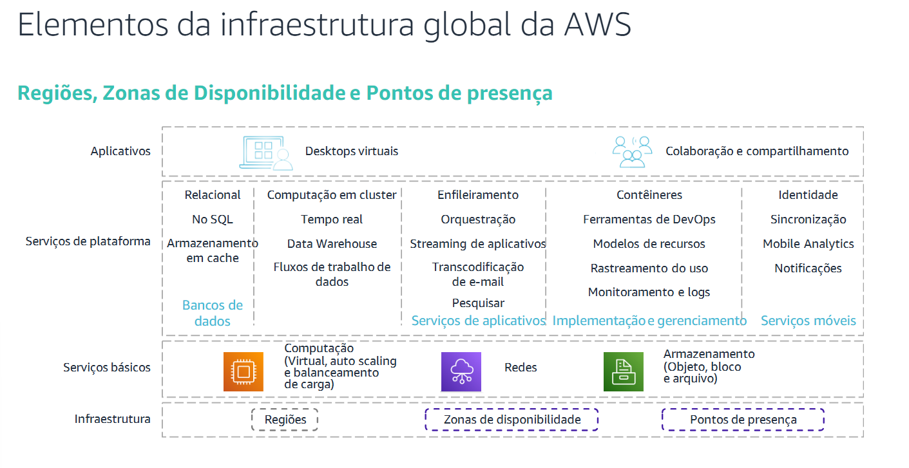
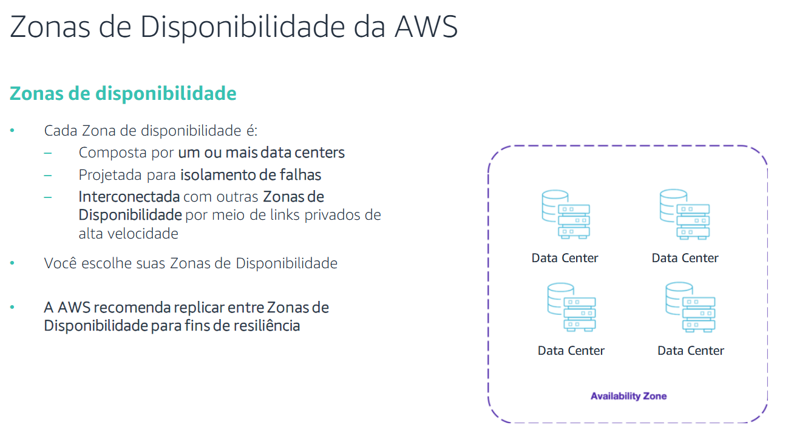
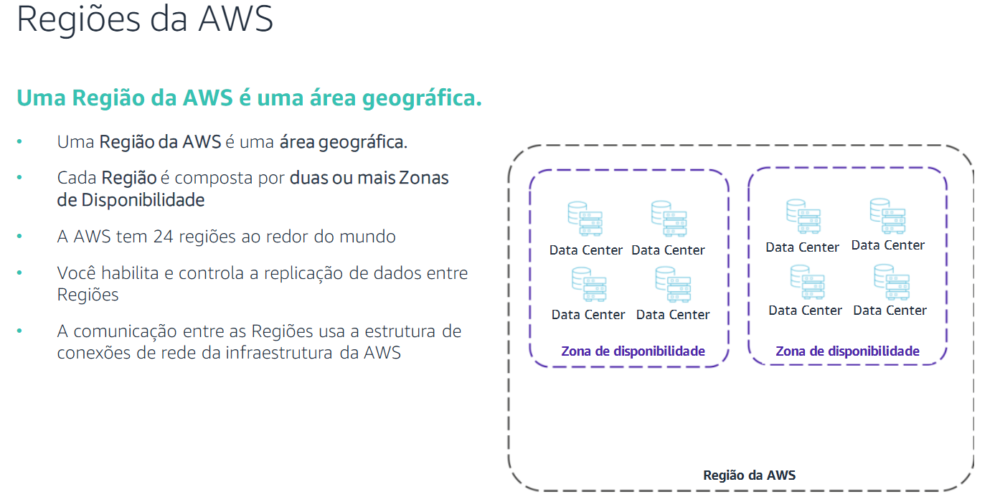
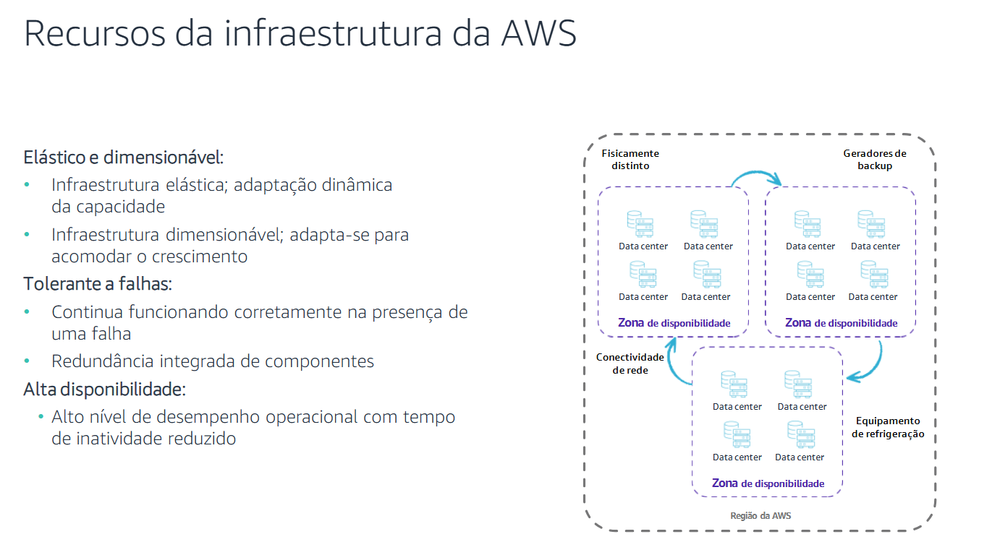

# 📌 Visão Geral da Infraestrutura da AWS

A infraestrutura global da AWS foi projetada para oferecer um ambiente de computação em nuvem flexível, confiável, escalável e seguro.

---

## 🌎 Infraestrutura Global da AWS

A AWS fornece um amplo conjunto de serviços, como computação, armazenamento, redes e bancos de dados, entregues como um utilitário sob demanda. Esses serviços residem na infraestrutura global da AWS.

### 🔹 Elementos da Infraestrutura Global da AWS

A infraestrutura global da AWS é composta por:

- **Regiões**
- **Zonas de Disponibilidade**
- **Pontos de Presença**

---

## 🏢 Data Centers da AWS

Os **data centers** são a base da infraestrutura da AWS. Um data center é um local onde os dados físicos são armazenados e processados.

🔹 Características dos data centers da AWS:

- Localização cuidadosamente planejada para mitigar riscos ambientais.
- Design redundante para tolerância a falhas e manutenção dos níveis de serviço.
- **Backups** distribuídos em várias **Zonas de Disponibilidade**.
- Acesso restrito e locais não divulgados para maior segurança.
- Cada data center abriga entre **50.000 e 80.000 servidores físicos**.
- **Redes privadas de alta velocidade** conectam os data centers dentro das regiões.

---

## ⚡ Zonas de Disponibilidade (AZs)

As **Zonas de Disponibilidade** (AZs) são compostas por um ou mais data centers discretos projetados para isolamento de falhas.

📌 Características das AZs:

- Recursos redundantes de energia, redes e conectividade.
- Proteção contra falhas localizadas.
- Interconectadas por redes privadas de alta velocidade.
- Algumas AZs possuem até **seis data centers**.

💡 **Recomendação da AWS:** Distribuir sistemas em **múltiplas Zonas de Disponibilidade** para maior resiliência e tolerância a falhas.

---

## 🌍 Regiões da AWS

Uma **Região da AWS** é uma área geográfica que contém **duas ou mais Zonas de Disponibilidade**.

🔹 Fatos sobre as Regiões:

- A AWS possui **24 Regiões** em todo o mundo.
- **Os dados armazenados em uma Região não são replicados automaticamente para outras.**
- Algumas Regiões possuem acesso restrito (exemplo: **AWS GovCloud**).

💡 **Dica:** Ao implantar um aplicativo, escolha uma Região próxima ao seu público-alvo para **reduzir latência** e **otimizar desempenho**.

---

## 📌 Seleção de uma Região AWS

Ao escolher uma Região, considere os seguintes fatores:

- **Requisitos legais e regulamentares**
- **Latência** (proximidade com usuários finais)
- **Disponibilidade de serviços** na Região escolhida
- **Custo** (os preços podem variar entre Regiões)

💡 Ferramenta útil: Use o [CloudPing](https://www.cloudping.info/) para testar a latência entre sua localização e as Regiões AWS.

---

## 🛠️ Recursos da Infraestrutura AWS

A infraestrutura da AWS é projetada para ser:

✅ **Escalável e elástica** → Ajusta dinamicamente a capacidade conforme a demanda.

✅ **Tolerante a falhas** → Redundância integrada para continuidade operacional.

✅ **Alta disponibilidade** → Reduz tempo de inatividade e intervenção humana.

💡 **Conclusão:** A arquitetura global da AWS oferece uma infraestrutura segura, escalável e resiliente, garantindo alto desempenho para aplicações modernas.

---

🚀 **Explore mais sobre a AWS e aproveite a escalabilidade da nuvem!**
